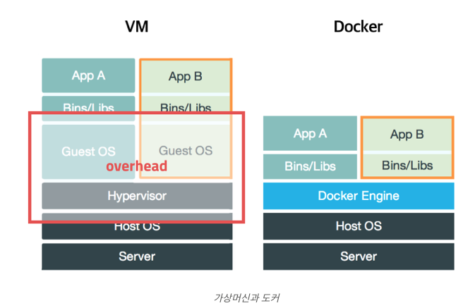
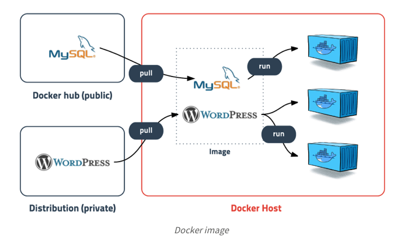
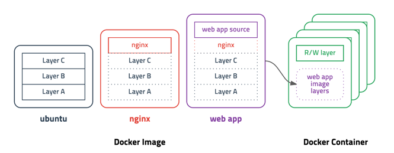
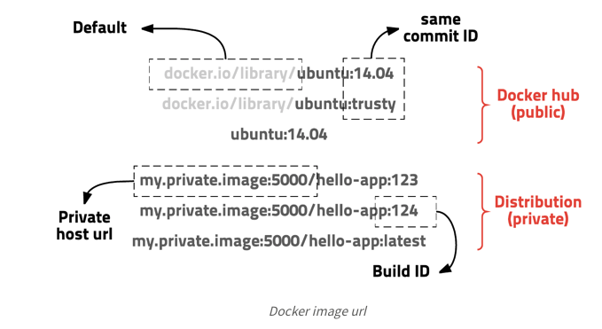

# Docker

## 도커란 무엇인가?

도커는 컨테이너 기반의 오픈소스 가상화 플랫폼이다. 컨테이너라고 하면 배에 실어나르는 네모난 화물 수송용 박스를 생각할수 있다. 그 안에는 옷, 신발, 전자제품, 술, 과일 등 다양한 화물을 넣을 수 있고 규격화되어 컨테이너선이나 트레일러 등 다양한 운송수단으로 쉽게 옮길 수 있다. ~~\(HMM 생각나네\)~~

서버의 컨테이너도 이와 비슷하게 다양한 프로그램, 실행환경을 컨테이너로 추상화하고 동일한 인터페이스를 제공하여 프로그램의 배포 및 관리를 단순하게 해준다. 

기존의 가상화 방식은 주로 OS를 가상화하는 방법 \(aka VMware ,VirtualBox 같은 가상머신은 호스트 OS위에 게스트 OS 전체를 가상화하여 사용하는 방식\) but 비교적 사용법이 간단하지만 무겁고 느려서 운영환경에선 사용 할 수가 없다. 이러한 상황을 개선하기 위해 CPU의 가상화 기술\(HVM\)을 이용한 KVM과 반가상화 방식의 Xen이 등장한다. 이러한 방식은 게스트 OS가 필요하지만, 전체 OS를 가상화하는 방식이 아니었기 때문에 호스트형 가상화 방식에 비해 성능이 향상되었다. 이러한 기술을은 OpenStack이나 AWS 같은 클라우드 서비스에서 가상 컴퓨팅 기술의 기반이 되었다.




전가상화든 반가상화 든 추가적인 OS를 설치하여 가상화하는 방법은 성능문제가 있었고, 이를 개선하기 위해 프로세스를 격리하는 방식이 등장 -&gt; 이것이 바로 리눅스 컨테이너

## 리눅스 컨테이너

리눅스 컨테이너는 단순히 프로세스를 격리시키기 때문에 가볍고 빠르게 동작한다. CPU나 메모리는 딱 프로세스가 필요한 만큼만 추가로 사용하고 성능적으로도 거의 손실이 없음 \(도커의 기본 네트워크 모드는 Bridge 모드로 약간의 성능 손실이 있음, 네트워크 성능이 중요한 프로그램의 경우 --net=host 옵션을 고려\)

이러한 컨테이너의 개념은 도커에서 처음만든 것은 아니고, 리눅스에선 cgroup와 LXC가 있었음. 

## 도커 이미지



이미지는 컨테이너 실행에 필요한 파일과 설정값등을 포함하고 있는 것으로 상태값을 가지지 않고 변하지 않는다. 컨테이너는 이미지를 실행한 상태라고 볼 수 있고, 추가되거나 변하는 값은 컨테이너에 저장된다. 같은 이미지에 여러개의 컨테이너를 생성할 수 있고 컨테이너의 상태가 바뀌거나, 삭제되어도 이미지는 변하지 않고 그대로 남는다. 

이미지는 컨테이너를 실행하기 위한 모든 정보를 가지고 있기에, 더 이상 의존성 파일을 컴파일하고 이것저것 설치할 필요가 없다. 또한, 도커 이미지는 Docker hub에 등록하거나 Docker Registry 저장소를 만들어 관리 가능

## 레이어 저장 방식



도커 이미지는 컨테이너를 실행하기 위한 모든 정보를 가지고 있어서, 용량이 크다. 이래서 점점 비효율적으로 되는데, 이러한 문제를 해결하기 위한 방식이 레이어라는 개념을 사용하고 유니온 파일 시스템을 이용하여 여러개의 레이어를 하나의 파일 시스템으로 사용할 수 있게 해준다. 예를들어 Ubuntu 이미지가 읽기 전용 레이어로 A + B + C의 집합이라면, nginx 이미지는 A + B + C + nginX + .... 이렇게 레이어가 나누어진다. 그리고 레이어가 다르기 때문에, 마치 포토샵에서 작업하듯 자기가 작업하려는 레이어만 효율적으로 관리 가능

컨테이너를 생성할 때도 레이어 방식을 사용하는데, 기존의 이미지 레이어 위에 읽기/쓰기 레이어를 추가한다. 이미지 레이어를 그대로 사용하면서 컨테이너가 실행 중에 생성하는 파일이나 변경된 내용은 읽기/쓰기 레이어에 저장되므로 여러개의 컨테이너를 생성해도 최소한의 용량을 사용한다. 

## 이미지 경로

이미지는 url 방식으로 관리하며 태그를 붙일 수 있다.  ubuntu 14.04 이미지는 `docker.io/library/ubuntu:14.04` 또는 `docker.io/library/ubuntu:trusty` 이고 `docker.io/library`는 생략가능하여 `ubuntu:14.04` 로 사용할 수 있습니다. 이러한 방식은 이해하기 쉽고 편리하게 사용할 수 있으며 태그 기능을 잘 이용하면 테스트나 롤백도 쉽게 할 수 있다. 



## Dockerfile

도커는 이미지를 만들기 위해 Dockerfile이라는 파일에 DSL \(domain-specific language\)를 사용하여 이미지 생성과정을 적는다. 

## Node JS Docker 이미지 만들기

1. package.json

```javascript
{
  "name": "docker_web_app",
  "version": "1.0.0",
  "description": "Node.js on Docker",
  "main": "server.js",
  "scripts": {
    "test": "node server.js"
  },
  "author": "rumblekat",
  "license": "ISC",
  "dependencies": {
    "express": "^4.17.1"
  }
}

```

2. express.js

```javascript
'use strict';

const express = require('express');

// 상수
const PORT = 8080;
const HOST = '0.0.0.0';

// 앱
const app = express();
app.get('/', (req, res) => {
  res.send('Hello World');
});

app.listen(PORT, HOST);
console.log(`Running on http://${HOST}:${PORT}`);
```

3. Dockerfile

여기서 가장먼저 해야할 것은 어떤 이미지를 사용해서 빌드할 것인지를 정의해야함. 여기서는 DockerHub에 있는 node의 LTS 버전인 12를 사용. 다음으로 이미지 안에 애플리케이션 코드를 넣기 위해 디렉토리 생성. 이 이미지에는 Node.js와 NPM이 설치되어 있으므로 npm 바이너리로 앱의 의존성을 설치하면됨\(버전 4이하의 npm는 package-lock.json을 생성하지 않는다.\) 작업 디렉터리 전체가 아닌 package.json 파일만을 복사하는데 이는 캐시된 Docker 레이어의 장점을 활용하기 위함 \(npm install를 하기 위해\) 

Docker 이미지 안에 앱의 소스코드를 넣기 위해 COPY 지시어를 사용하고, 앱이 8080포트에 바인드 되어 있으므로, EXPOSE지시어를 사용하여 docker 데몬에 매핑한다. 

```javascript
FROM node:12
# 앱 디렉토리 생성
WORKDIR /usr/src/app
#앱 의존성 설치
#package-json / pacakge-lock.json의 의존성 설치를 위해 와일드 카드 사용
COPY package*.json ./

RUN npm install
# 프로덕션을 위한 코드를 빌드하는 경우
# RUN npm ci --only=production

# 앱 소스 추가
COPY . .

EXPOSE 8080
CMD ["node", "server.js"]


```

4. .dockerignore

```javascript
node_modules
npm-debug.log

#Docker 이미지에 로컬 모듈과 디버깅 로그를 복사를 막음#
```

5.이미지 빌드

```javascript
docker build . -t <your username>/node-web-app
```

```javascript
$ docker images

# 예시
REPOSITORY                      TAG        ID              CREATED
node                            12         1934b0b038d1    5 days ago
<your username>/node-web-app    latest     d64d3505b0d2    1 minute ago
```

