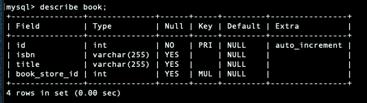

# JPA

## **관계형 데이터베이스와 자바**

Persistence \(영속성\)이란 어떤 정보를 저장하고, 앱을 다시 켜도 그 데이터는 유지가 됨 

### 기존 JDBC를 이용할때 문제점?

* SQL을 실행하는 비용이 비싸다.
* SQL이 DB마다 다르다.
* 스키마를 바꿨는데 코드가 바뀐다.
* 반복적인 코드가 많고, 당장 쓸모없는 데이터도 많이 받아오는 경우가 많

###  JDBC 코드 샘플

```java
public class Application {

    public static void main(String[] args) throws SQLException {
        String url = "jdbc:postgresql://localhost:5432/springdata";
        String username = "root";
        String password = "0000";

        try(Connection connection = DriverManager.getConnection(url, username, password)){
            System.out.println("Connection created: "+ connection);
            String sql = "CREATE TABLE ACCOUNT (id int, username varchar(255), password varchar(255));";
            sql = "INSERT INTO ACCOUNT VALUES(1, 'root', '0000');";
            try(PreparedStatement statement = connection.prepareStatement(sql)){
                statement.execute();
            }
        }
    }
}

```

## ORM이란

애플리케이션의 클래스와 SQL 데이터베이스 테이블 사이의 매핑 정보를 기술한 메타데이터를 사용하여, 자바 객체를 SQL데이터베이스의 테이블에 자동으로 영속화 해주는 기술 =&gt; 도메인 모델을 사용하는 방식 \(행위와 데이터를 둘다 아우르는 도메인의 개념 모델\)

## 도메인 모델을 사용하려는 이유?

* 객체 지향 프로그래밍의 장점을 활용하기 좋다. 
* 각종 디자인 패턴
* 코드 재사용
* 비즈니스 로직 구현 및 테스트 편리성 

## 비침투성 논란의 여지

* trasparent: 자기 자신의 코드를 숨기려고함
* SpringFramework, Hibernate, ORM도 비 침투성적 철학을 가지고 있으나, EntityManager를 사용하기 때문에 아주 비침투적이지 않다.

## ORM 패러다임 불일치

* 밀도 문제 --&gt;  객체 : 다양한 크기 만들수 있고, 커스텀 만들수 있다. / 테이블 :  고정 크기 
* 서브 타입 문제 --&gt; 객체 : 상속구조 / 테이블 : 테이블 상속이 없음 
* 식별성의 문제 --&gt; 객체 : == equals / 테이블 : primary key
* 관계 문제 --&gt; 객체 : 근본적으로 방향이 존재 \(다대다\) / 테이블 : 외래키로 관계 표현 Join으로 아무거나 만들수 있음
* 데이터 네비게이션 문제 --&gt; 레퍼런스를 이용해서 다른 객체로 이동가능 / db 억세스 최소화를 위해 Join을 쓰지만, 너무 한번에 많이 가져오는 것도 성능 이슈, 그렇다고 lazy loading을 하기에도 문제 \(n+1 select\)

### JPA DDL 자동설정 옵션

* `create`: 스키마와 데이터가 매번 새롭게 생성됨 개발시 사용
* `update`: 스키마와 데이터를 유지하면서 스키마나 데이터에 대한 변경사항을 적용\(스키마 변경시 이전 스키마가 남아있음\)
* `create-drop`: 스키마와 데이터가 매번 새롭게 생성되고 종료시 제거 됨
* `validate`: 스키마를 검증만 해준다 운영시 사용

```java
spring.jpa.hibernate.ddl-auto=create

spring.jpa.properties.hibernate.format_sql=true
spring.jpa.show-sql=true

```

## JDBC 사용시 application\_properties

JPA는 hibernate가 구현체 이므로, 프로그램 시작과, 종료시 DDL을 자동으로 처리하려면, ddl-auto 옵션이 매우 중요하다. 

```java
spring.jpa.show-sql=true
spring.jpa.properties.hibernate.format_sql=true
spring.datasource.url=jdbc:mysql://localhost:3306/toby?useSSL=false&characterEncoding=UTF-8&serverTimezone=UTC
spring.datasource.username=root
spring.datasource.password=Init123$
spring.datasource.driver-class-name=com.mysql.jdbc.Driver

spring.jpa.database=mysql
spring.jpa.hibernate.ddl-auto=create
spring.jpa.database-platform=org.hibernate.dialect.MySQL5InnoDBDialect
spring.jpa.hibernate.use-new-id-generator-mappings= false

```


##  맵핑 어노테이션

* `@Id`: 데이터베이스 주키\(Primary Key\)에 맵핑
* `@GeneratedValue`: 자동 생성 설정
* `@Entity`: 클래스명에 해당되는 테이블에 맵핑

어플리케이션을 실행하면, @Entity 로 모두 테이블에 자동매핑 컬럼생성 -&gt; datasource 타입의 빈을 만들고, 빈들은 application.properties 정보를 참조하여 만들어진다.

```java
import lombok.*;
import javax.persistence.*;

@Entity
@Getter
@NoArgsConstructor
@AllArgsConstructor
@ToString
public class Team {
    @Id
    @Column(name = "TEAM_ID")
    private String id;

    private String name;
}
```

```java
import org.springframework.data.jpa.repository.JpaRepository;

public interface TeamRepository extends JpaRepository<Team,Long> {
}
```

## EntityManager 

* `@PersistenceContext`를 통해서 **JPA**의 핵심인 **EntityManager**를 주입 받음
* 이 클래스를 통해서 **Entity**들을 영속화 할 수 있음\(데이터베이스에 저장\)
* **JPA**와 관련된 모든 **Operation**들은 한 **Transaction** 안에서 일어나야함
* **Spring**에서 제공하는 `@Transactional`을 사용 클래스,메서드에 적용할 수 있음

```java
import com.rumblekat.jpastudy.domain.tram.MemberRepository;
import com.rumblekat.jpastudy.domain.tram.Team;
import com.rumblekat.jpastudy.domain.tram.TeamRepository;
import org.junit.Test;
import org.junit.runner.RunWith;
import org.springframework.beans.factory.annotation.Autowired;
import org.springframework.boot.test.context.SpringBootTest;
import org.springframework.test.context.junit4.SpringRunner;
import org.springframework.transaction.annotation.Transactional;

import javax.persistence.EntityManager;
import javax.persistence.PersistenceContext;

import static org.assertj.core.api.Assertions.assertThat;

@RunWith(SpringRunner.class)
@SpringBootTest
public class MemberTeamTest {

    @Autowired
    MemberRepository memberRepository;

    @Autowired
    TeamRepository teamRepository;

    @PersistenceContext
    EntityManager entityManager;

    @Test
    @Transactional
    public void 엔티티매니저_테스트(){
        Team team1 = new Team("team1", "팀1");
        entityManager.persist(team1);

        Team team2 = new Team("team2", "팀2");
        teamRepository.save(team2);

        assertThat(teamRepository.findAll().size()).isEqualTo(2);
        assertThat(entityManager.createQuery("SELECT t FROM Team as t",Team.class).getResultList().size()).isEqualTo(2);

        teamRepository.findAll().forEach(System.out::println);
    }


}

```


## Fetch

연관 관계의 엔티티의 정보를 지금\(**Eager**\) 나중에\(**Lazy**\) 가져올지 설정  
잘 조정해야 성능을 향상시킬 수 있음

* `@OneToMany`의 기본값은 **Lazy**:
  * 기본적으로 해당 **Entity**의 정보를 가져올때 **Lazy**가 적용된 `@OneToMany` 관계의 **Entity**의 정보를 가져오지는 않음
  * 얼마나 많이 있을 지도 모르고 사용하지도 않을 값들을 다 가져오면 객체에 불필요한 정보를 로딩할 수도 있으므로
* `@ManyToOne`의 기본값은 **Eager**: 해당 **Entity**의 정보를 가져올때 **Eager**로 설정된 `@ManyToOne` 관계의 **Entity**의 정보도 같이 가져옴

## Book

```java
import lombok.Getter;
import lombok.Setter;

import javax.persistence.*;

@Entity
@Getter @Setter
public class Book {

    @Id @GeneratedValue
    private int id;
    private String isbn;
    private String title;

    @ManyToOne
    private BookStore bookStore;

}

```



## Book Store

```java
import lombok.Getter;
import lombok.Setter;

import javax.persistence.Entity;
import javax.persistence.GeneratedValue;
import javax.persistence.Id;
import javax.persistence.OneToMany;
import java.util.HashSet;
import java.util.Set;

@Entity
@Getter @Setter
public class BookStore {
    @Id @GeneratedValue
    private Integer id;

    private String name;

    @OneToMany(mappedBy = "bookStore")
    private Set<Book> books = new HashSet<>();

    public void add(Book book){
        this.books.add(book);
    }

}

```


## 잘못된 예시

CRUD 객체 지향적으로 생각해야된다.   [https://youtu.be/brE0tYOV9jQ](https://youtu.be/brE0tYOV9jQ)

```java
import com.rumblekat.jpastudy.domain.tram.Book;
import com.rumblekat.jpastudy.domain.tram.BookStore;
import com.rumblekat.jpastudy.domain.tram.BookStoreRepository;
import com.rumblekat.jpastudy.domain.tram.BooksRepository;
import org.junit.Test;
import org.junit.runner.RunWith;
import org.springframework.beans.factory.annotation.Autowired;
import org.springframework.boot.test.context.SpringBootTest;
import org.springframework.test.context.junit4.SpringRunner;

@RunWith(SpringRunner.class)
@SpringBootTest
public class DemoJPATest {
    @Autowired
    BookStoreRepository bookStoreRepository;

    @Autowired
    BooksRepository booksRepository;

    @Test
    public void contextLoad(){
        BookStore bookStore = new BookStore();
        bookStore.setName("시애틀 책방");
        bookStoreRepository.save(bookStore);

        Book book = new Book();
        book.setTitle("study");

        bookStore.add(book);

        booksRepository.save(book);
    }

}
```


## 정답

```java
import lombok.Getter;
import lombok.Setter;

import javax.persistence.Entity;
import javax.persistence.GeneratedValue;
import javax.persistence.Id;
import javax.persistence.OneToMany;
import java.util.HashSet;
import java.util.Set;

@Entity
@Getter @Setter
public class BookStore {
    @Id @GeneratedValue
    private Integer id;

    private String name;

    @OneToMany(mappedBy = "bookStore")
    private Set<Book> books = new HashSet<>();

    public void add(Book book){
        book.setBookStore(this); // <--- book 테이블 기준으로 외래키값을 직접 넣어줘야됨  
        this.books.add(book);
    }

}

```


