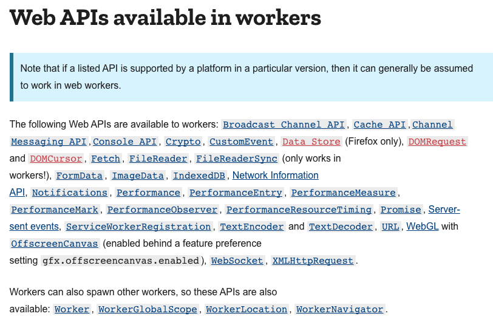

# WebWorker와 ServiceWorker

## Web Worker란?

 웹 워커는 스크립트 연산을 웹 어플리케이션의 주 실행 스레드와 분리된 별도의 백그라운드 스레드에서 실행할 수 있는 기술. 웹 워커를 통해 무거운 작업을 분리된 스레드에서 처리하면, 주 스레드가 멈추거나 느려지지 않고 동작할 수 있다.  [WebWorker](https://developer.mozilla.org/ko/docs/Web/API/Web_Workers_API) [ServiceWorker](https://developers.google.com/web/fundamentals/primers/service-workers) 

## Web Worker의 단점

1. 워커에서 DOM을 직접 조작할 수 없고, Window의 일부 메서드와 속성은 사용 불가. 그러나 [웹소캣](websocket.md) [IndexedDB](indexeddb.md) 를 포함한 많은 수의 항목도 사용 가능

